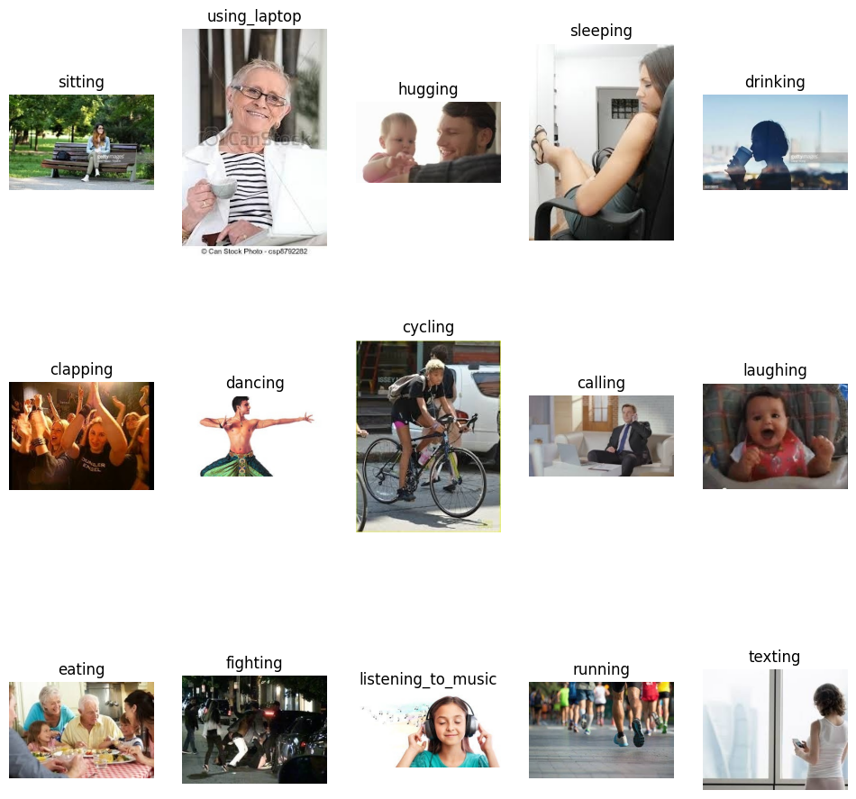

### Abstract

The study leverages the Human Action Recognition (HAR) dataset, which can be accessed [here](https://www.kaggle.com/datasets/meetnagadia/human-action-recognition-har-dataset/data). Alongside this documentation, the trained models and associated Jupyter Notebook (.ipynb) files have been attached for reproducibility and further exploration.

# Deep Learning for Human Action Recognition

## Objective
The goal of this project is to develop a Convolutional Neural Network (CNN) model to classify human activities from images. The model is trained to recognize and label activities from 15 predefined categories based on visual content.

## Dataset
The dataset comprises over 12,000 labeled images categorized into 15 human activity classes:

- **Calling**
- **Clapping**
- **Cycling**
- **Dancing**
- **Drinking**
- **Eating**
- **Fighting**
- **Hugging**
- **Laughing**
- **Listening to Music**
- **Running**
- **Sitting**
- **Sleeping**
- **Texting**
- **Using Laptop**

Each class contains 840 training images, and the dataset is balanced with no missing or duplicate values.

Here are some sample images from the dataset:


## Methodology

### 1. **Data Exploration**
- Inspect dataset structure (e.g., number of classes, number of images per class).
- Visualize sample images from each class.
- Check image dimensions and label distributions.

### 2. **Data Preprocessing**
- Resize images to **128x128 pixels**.
- Normalize pixel values to [0,1].
- Encode labels and split data into training (80%) and validation (20%) sets.
- Apply data augmentation (e.g., rotations, zoom, flips).
- Preprocess test data similarly.

### 3. **CNN Model Design**
- **Input Layer:** (128, 128, 3).
- **Convolutional Blocks:**
  - 32, 64, 128, 256 filters with (3x3) kernels, ReLU activation, and max-pooling.
- **Dense Layers:**
  - 512 and 256 neurons with ReLU and dropout (rate: 0.5).
- **Output Layer:** Softmax activation for 15 classes.
- **Compilation:** Adam optimizer (learning rate: 0.0001), sparse categorical cross-entropy loss, and accuracy metric.

### 4. **VGG16-Based Model Design**
- **Feature Extractor:** Pre-trained VGG16 (ImageNet weights, frozen base).
- **Dense Layers:**
  - Fully connected layers with 512 neurons and ReLU activation.
- **Output Layer:** Softmax for classification.
- Fine-tuned the model on the dataset.

### 5. **Model Training and Evaluation**
- Trained CNN and VGG16 models on the processed dataset.
- Validation metrics were monitored for overfitting.

## Results

The performance of the models is summarized in the table below:

<table style="width: 100%; border-collapse: collapse;">
    <tr>
        <th style="border: 1px solid black; padding: 8px; text-align: center;">Metric</th>
        <th style="border: 1px solid black; padding: 8px; text-align: center;">CNN Model</th>
        <th style="border: 1px solid black; padding: 8px; text-align: center;">VGG Model</th>
    </tr>
    <tr>
        <td style="border: 1px solid black; padding: 8px; text-align: center;">Training Accuracy</td>
        <td style="border: 1px solid black; padding: 8px; text-align: center;">79.44%</td>
        <td style="border: 1px solid black; padding: 8px; text-align: center;">81.17%</td>
    </tr>
    <tr>
        <td style="border: 1px solid black; padding: 8px; text-align: center;">Validation Accuracy</td>
        <td style="border: 1px solid black; padding: 8px; text-align: center;">54.05%</td>
        <td style="border: 1px solid black; padding: 8px; text-align: center;">46.91%</td>
    </tr>
    <tr>
        <td style="border: 1px solid black; padding: 8px; text-align: center;">Final Training Loss</td>
        <td style="border: 1px solid black; padding: 8px; text-align: center;">0.634</td>
        <td style="border: 1px solid black; padding: 8px; text-align: center;">0.548</td>
    </tr>
    <tr>
        <td style="border: 1px solid black; padding: 8px; text-align: center;">Validation Loss</td>
        <td style="border: 1px solid black; padding: 8px; text-align: center;">1.835</td>
        <td style="border: 1px solid black; padding: 8px; text-align: center;">2.560</td>
    </tr>
    <tr>
        <td style="border: 1px solid black; padding: 8px; text-align: center;">Test Accuracy (from Contest)</td>
        <td style="border: 1px solid black; padding: 8px; text-align: center;">56.53%</td>
        <td style="border: 1px solid black; padding: 8px; text-align: center;">48.29%</td>
    </tr>
    <tr>
        <td style="border: 1px solid black; padding: 8px; text-align: center;">Practice Rank</td>
        <td style="border: 1px solid black; padding: 8px; text-align: center;">8th</td>
        <td style="border: 1px solid black; padding: 8px; text-align: center;">N/A</td>
    </tr>
</table>

## Usage

1. Clone this repository.
2. Load the `ipynb` files in Jupyter Notebook or Google Colab.
3. Ensure you have downloaded the HAR dataset from the provided link.
4. Follow the code to train or evaluate the models.

## Project Structure
```
├── images
│   ├── sample_image.png
├── best_cnn_model.keras
├── best_vgg_model.keras
├── cnn_model_test.csv
├── vgg_model_test.csv
├── README.md
└── har-detection-testing-accuracy-56.ipynb

```

## Acknowledgments
This project demonstrates the application of deep learning techniques in human activity recognition using image data, highlighting both challenges and potential improvements for practical deployment.
